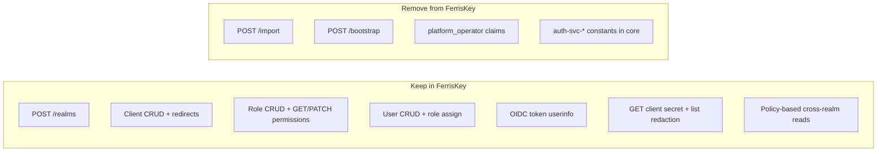

# Facade separation plan — FerrisKey fork

Agent playbook for reducing `feat/platform-automation` to a **standard generic IAM** codebase. Remove Barrzen auth-facade coupling so FerrisKey does not know `auth-svc-*`, `tenant-default`, or custom JWT product claims.

**Out of scope:** opening PRs to `ferriskey/ferriskey`, Barrzen client IDs/templates, auth-api routes, Angie/Flyger edge. Upstream PR work is a separate initiative after FerrisKey team discussion.

**Coordination:** Barrzen Auth Service owns tenant provisioning orchestration ([`docs/facade-separation-plan.md`](https://github.com/Barrzen/barrzen-auth-service/blob/main/docs/facade-separation-plan.md) in that repo). Auth services keep pinning git tag **`pre-separation`** (`2fa142fe`) until Barrzen confirms `TENANT_PROVISION_MODE=orchestrate` passes smoke and bumps `docker/ferriskey.lock`.

---

## Implementation status (2026-06-29)

| Phase | Status | Notes |
|-------|--------|-------|
| F0 | Done | Tag `pre-separation` at `2fa142fe` |
| F1 | Done | `docs/cross-realm-admin.md`; `cross_realm_service_account_test.rs`, `admin_api_symmetry_test.rs` |
| F2 | Done (branch) | Bootstrap/import/platform_operator removed from working tree |
| F3 | Done | `.cursor/`, `graphify-out/` removed; `.gitignore` updated |
| F4 | Pending CI/local | Run `cargo test --workspace --lib` and ignored api tests |
| F5 | Pending | Push branch; **do not** bump auth-service pin until Barrzen orchestrate green |

Cross-realm admin guide: [`docs/cross-realm-admin.md`](cross-realm-admin.md).

---

## Goal

FerrisKey remains a reusable IdP: complete admin API, sound OAuth, policy-based cross-realm access. Product-specific tenant blueprints live in auth-api, not in FerrisKey core.

## Target end state



---

## Phase F0 — Inventory and freeze

- Tag current `feat/platform-automation` tip (`2fa142fe…`) as last known-good fork pin for auth services until Barrzen orchestrator lands (`pre-separation` tag recommended).
- Facade-touched files (do not extend with new product APIs):

| File | Facade concern |
|------|----------------|
| `core/src/domain/realm/bootstrap.rs` | Barrzen tenant blueprint |
| `core/src/domain/realm/templates.rs` | `tenant-default` template |
| `core/src/domain/realm/platform.rs` | Hardcoded `auth-svc-m2m` platform operator |
| `core/src/domain/realm/services.rs` | `assign_platform_operator_realm_admin` in `create_realm` |
| `core/src/domain/authentication/services.rs` | `platform_operator` / `managed_realms` JWT claims |
| `api/src/application/http/realm/handlers/bootstrap_realm.rs` | `POST /bootstrap` |
| `api/src/application/http/realm/handlers/import_realm.rs` | `POST /import` |
| `api/tests/bootstrap_realm_test.rs` | Bootstrap/import tests |
| `api/tests/platform_operator_test.rs` | Custom claim tests |
| `docs/platform-integration.md` | Barrzen auth-service integration doc |

- **Do not add** new Barrzen-specific APIs during this work.

---

## Phase F1 — Keep and harden (standard IAM gaps)

Recommended IdP admin patterns — keep, ensure tests + OpenAPI, strip `auth-svc` references from comments:

| Feature | Files | Standard rationale |
|---------|-------|-------------------|
| `GET .../roles/{id}/permissions` | `api/src/application/http/role/handlers/get_role_permissions.rs` | API symmetry with PATCH |
| `GET .../clients/{id}/secret` + redact on list/get | `api/src/application/http/client/handlers/get_client_secret.rs`, `core/src/domain/client/services.rs` | Secret hygiene (Keycloak-style) |
| Idempotent `POST .../redirects` | `core/src/domain/client/services.rs` | Safe automation retries |
| Password-grant `/userinfo` | auth + userinfo path, `api/tests/userinfo_password_grant_test.rs` | OIDC correctness bug fix |
| Cross-realm permission reads | `core/src/domain/user/services.rs`, role services | Policy-only; no hardcoded client id |

**Refactor cross-realm (critical):** replace `is_platform_operator_client` / `auth-svc-m2m` checks with existing policy (`get_permission_for_target_realm`): caller may read/manage target realm when their token's roles grant the required permission on that realm.

Add `docs/cross-realm-admin.md` — generic description of cross-realm admin via role assignment (no product client names).

---

## Phase F2 — Remove facade surface

**Gate:** Barrzen agent confirms orchestrate mode green before merging F2.

1. **HTTP routes:** remove `/realms/{name}/bootstrap`, `/realms/{name}/import` — handlers, router entries, validators, OpenAPI paths.
2. **Domain:** delete `bootstrap.rs`, `templates.rs`, `platform.rs`; remove `BootstrapRealmInput` / `BootstrapRealmReport` from `core/src/domain/realm/ports.rs` if only used by bootstrap.
3. **Realm create hook:** remove `assign_platform_operator_realm_admin` from `create_realm` in `core/src/domain/realm/services.rs`; restore standard `{realm}-realm` role permissions (upstream default).
4. **Token claims:** remove `platform_operator` / `managed_realms` from `core/src/domain/authentication/services.rs`.
5. **Tests:** remove `bootstrap_realm_test.rs`, `platform_operator_test.rs`; add/keep F1 tests; add cross-realm test with role-assigned service account (replaces platform_operator_test).
6. **Docs:** remove or archive `docs/platform-integration.md`; point integrators to standard admin API (realms, clients, roles, users).

---

## Phase F3 — Dev tooling cleanup (non-IAM)

- Remove graphify/Cursor rules artifacts from fork branch if present (`.cursor/rules/*`, `graphify-out/*`) — not part of IAM product.
- Update `.gitignore` to exclude graphify output permanently.

---

## Phase F4 — Verification

```bash
cargo test --workspace --lib
cargo test -p ferriskey-api -- --ignored   # Postgres required
```

Integration coverage (ignored tests):

- Secret endpoint
- Role permissions GET
- Userinfo password grant
- Cross-realm read with role-assigned service account

Manual check: master M2M service account assigned to tenant `{realm}-realm` role via **standard** user-role API can `GET /realms/{tenant}/clients` (proves policy path without custom claims).

---

## Cross-repo milestones

| Milestone | FerrisKey (this repo) | Barrzen Auth Service |
|-----------|----------------------|----------------------|
| M1 | F0 + F1 complete | B0 + B1 + B2 behind `orchestrate` flag |
| M2 | F1 cross-realm policy + SA role test | B3 tests green on `orchestrate` |
| M3 | F2 removal merged | B5 cutover + pin bump |
| M4 | F3 + F4 verification | LMS Auth Service copy (manual) |

Barrzen agent posts **orchestrate green** before this agent runs F2.

---

## Out of scope (explicit)

- Opening PRs to upstream `ferriskey/ferriskey`
- Barrzen `auth-svc-*` client IDs, tenant templates, auth-api public routes
- Angie / Flyger edge stack
